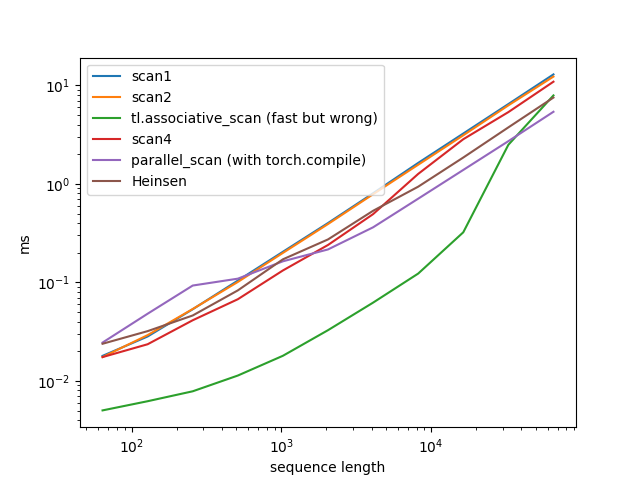

# Scans

- See also: [Chunked Scan](https://proger.github.io/posts/scan/chunk.html)
- Tweets https://twitter.com/darkproger/status/1741453063980830878
- CUDA mode group has an aggregator of more scan implementations: https://github.com/cuda-mode/resource-stream
- [block scan algorithms in cub](https://nvlabs.github.io/cub/namespacecub.html#abec44bba36037c547e7e84906d0d23aba0fa6cac57b7df2f475a67af053b9371c)
